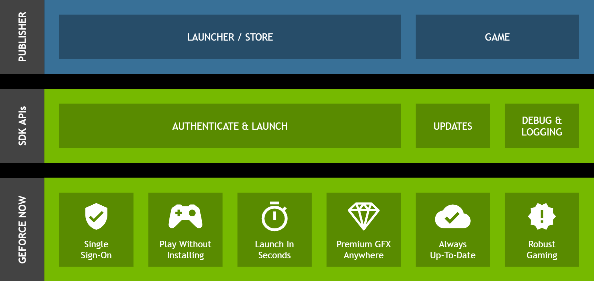

# NVIDIA GeForce NOW SDK Release 2.4

## At a Glance

The GeForce NOW SDK (GFN SDK) is a means for game developers and publishers to directly integrate with GeForce NOW, NVIDIA's Cloud Gaming Service, which allows users to experience GeForce gaming anywhere and enables publishers and game developers to take advantage of high-performance rendering through NVIDIA's top-notch DirectX and Vulkan drivers on both Windows and Linux platforms.

The GFN SDK provides an ever-growing set of APIs that allows GFN partners to allow their games and applications to have a more seamless integration with GeForce NOW features. These features include abilities for games and applications to:
* Run on a wide range of devices without needing to port to each device and operating system.
* Know when they are running inside the secure GeForce NOW environment to allow the bypass of certain system checks such as Display Driver versioning or application binary verification.
* Obtain information about the user's client system, including touch support, to tailor the user's experience to their environment.
* Allow GFN sessions to start from a host application or [GFN Client Deep Link](./doc/SDK-GFN-DEEP-LINKING.pdf), providing streaming of games and applications without needing to build a cloud gaming environment.
* Allow customers to get into games and applications faster with GFN's Pre-Warm features.


The GFN SDK is ever-evolving to provide easy integration of GeForce NOW features into publisher applications and games, as well as more efficient way to integrate games into the GeForce NOW ecosystem.

Please refer to the [SDK GFN Primer](./doc/SDK-GFN-PRIMER.pdf) for a more detailed overview of the features, and to get up and running quickly with the APIs, refer to the [SDK Quick Start Guide](./doc/SDK-GFN-QUICK-START-GUIDE.pdf) for common integration scenarios, and code snippets to use for APIs.

### What's New in This Release

* Added `gfnOpenURLOnClient` API for app to request client application to open a URL in their local web browser.
* Added `OpenClientBrowser` sample to demonstrate `gfnOpenURLOnClient` API usage.
* Added `PreWarmSample` sample to demonstrate usage of the APIs and callbacks associated with PreWarm feature.
* Added touch input support to `CubeSample` app.
* Various bug fixes and improvements.

## GeForce NOW Developer Portal

* Please [contact us](mailto:gdp-queries@nvidia.com) to register your organization or game with the GeForce NOW Developer Portal.

## Development Guide

### Software Stack



Each feature has different integration points. Some features define REST Web APIs, while others integrate into the game or publisher application with native C interfaces. Refer to documentation for each feature in the doc folder.

Some features require a compatible version of GeForce NOW to be installed on the client system. The integrated GFN SDK components are designed to take care of downloading and installing GeForce NOW client when needed.

### GeForce NOW SDK Package

The distribution is laid out as below:
```
.
├─── CMakeLists.txt
├─── CMakePresets.json
├─── LICENSE
├─── LICENSE.samplelauncher.thirdparty
├─── LICENSE.thirdparty
├─── README.md
|
├─── doc
|   │   SDK-GFN-ACCOUNT-LINKING-SSO-GUIDE.pdf
|   │   SDK-GFN-CLOUD-API.pdf
|   │   SDK-GFN-DEEP-LINKING.pdf
|   │   SDK-GFN-MOBILE-TOUCH-INTEGRATION-GUIDE.pdf
|   │   SDK-GFN-IP-API-GUIDE.pdf
|   │   SDK-GFN-PRIMER.pdf
|   │   SDK-GFN-QUICK-START-GUIDE.pdf
|   │   SDK-GFN-UNREALENGINE-INTEGRATION-GUIDE.pdf
|   └───SDK-GFN-RUNTIME
|       └───index.html
|
├───include
│       GfnRuntimeSdk_CAPI.h
│       GfnRuntimeSdk_Wrapper.c
│       GfnRuntimeSdk_Wrapper.h
│       GfnSdk.h
│       GfnSdk_SecureLoadLibrary.c
│       GfnSdk_SecureLoadLibrary.h
│
├───linux
│   └───x64
│           GfnRuntimeSdk.so
├───win
│   ├───x64
│   │       GfnRuntimeSdk.dll
│   │
│   └───x86
│           GfnRuntimeSdk.dll
│
└───samples
    |   README.md
    ├───CGameAPISample
    ├───CloudCheckAPI
    ├───Common
    ├───CubeSample
    ├───OpenClientBrowser
    ├───PartnerDataAPI
    ├───PreWarmSample
    ├───SampleLauncher
    └───SDKDllDirectRefSample

```

## SDK Build Overview

The components that are needed to use the GeForce NOW SDK in your application
come pre-built, and do not require any additional build steps to use in your
project(s). Refer to the SDK Primer and Quick Start guides located in the ./doc
folder for more info on integrating the SDK and calling the APIs in your 
applications.

If you wish to build the samples included in this SDK distribution to use as
examples on how to call the GeForce NOW SDK's APIs on either Windows or Linux,
you will first need cmake 3.27 or greater installed to configure the makefiles.
If cmake 3.27 or greater is not installed, refer to https://cmake.org for 
installation information for your Operating System.

The Operating Systems supported by the GeForce NOW SDK APIs and samples are:
* Windows x64
* Windows x86
* Linux x64, specifically, Ubuntu 22 or greater

### Building On Windows

There are two methods to build for Windows:
* Command Line
* Visual Studio's cmake support 

#### Command Line Method

To build from the command line the simplest way, you will need a build 
system manager such as ninja-builder (https://ninja-build.org/) installed and 
available via your PATH environment variable. If you do not have it installed,
follow the instructions on the website.

You will also need Visual Studio installed, along with the Visual Studio
Developer Comand Prompt tools installed. Finally, you will need to have 
Visual Studios command line build tools available as part of your PATH. 

Once these tools are configured, open a command prompt to the root of the
GeForce NOW SDK distribution package, and use cmake to configure the makefiles
via one of the presets:

* -x64-windows-debug
* -x64-windows-release
* -x86-windows-debug
* -x86-windows-release

Example:
```
cmake --preset x64-windows-release
```

This will allow cmake to configure the makefiles and use ninja to find the 
compiler tools to build the samples. Once done, there will be an "_out" folder
at the root of the distribution, with a subfolder named as the present used.
Example:

./_out/x64-windows-debug/

You can change directory to this subfolder and to the subfolder for the sample
you wish to run, and execute the sample's executable binary from there.

#### Visual Studio CMake Method

If you wish to configure the project and build from Visual Studio, then you
will need to have Visual Studio's cmake support tools installed. If you are
not familiar with this feature, please see this link:
https://learn.microsoft.com/en-us/cpp/build/cmake-projects-in-visual-studio

Please make sure to have the support for cmake 3.19 or greater installed.

Once cmake 3.19 or greater support is available in your version of Visual
Studio, then follow these steps:
1. Open Visual Studio.
2. Select the "Open Folder" option.
3. Point Visual Studio to the root folder of the GeForce NOW SDK distribution.
(This is the folder that containts CMakeLists.txt and this README text file.)

Once opened, Visual Studio's cmake support will automatically configure the 
build based on the makefiles in the distribution, allowing you to build all or
individual samples.

### Building for Linux

In addition to cmake 3.27 or greater, you will also need to have
ninja-build (https://ninja-build.org/) installed. If you do not have it
installed, follow the instructions on the website.

Once installed, open a command prompt to the root of the GeForce NOW SDK
distribution package, and use cmake to configure the makefiles for Linux for
one of the Linux presets:

* -x64-linux-debug
* -x64-linux-release

Example:
```
cmake --preset x64-linux-release
```
This will configure the makefiles for the specified preset, and create the
"_out" folder at the root of the distribution folder structure, with a
subfolder with the same  name as the preset used. To build the samples, run cmake
again with the same preset with the --build flag.
```
cmake --build --preset x64-linux-release
```
This will produce the build in a subfolder corresponding to the name of the
sample under "/samples" in the current directory. You can then run the sample
from the subfolder. Example:

./_out/x64-linux-release/samples/SampleLauncher/SampleLauncher
